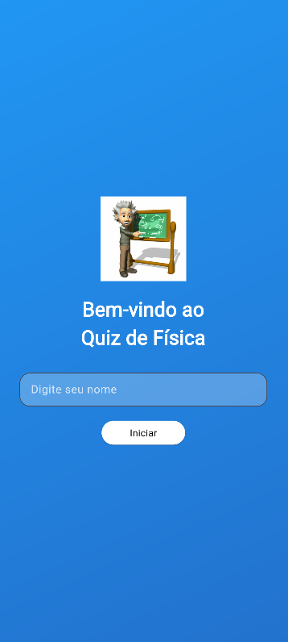
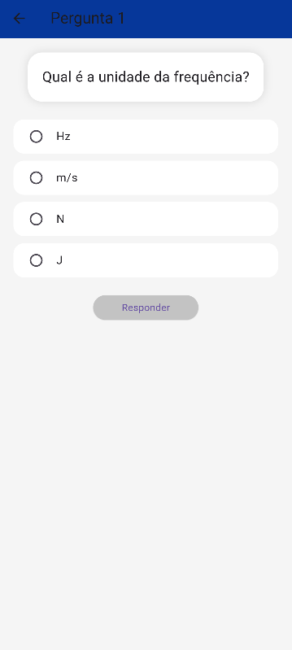
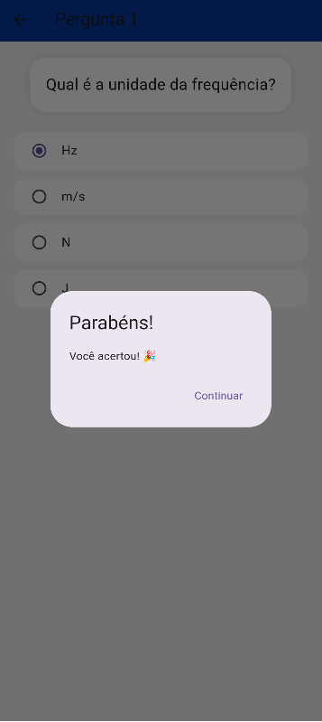
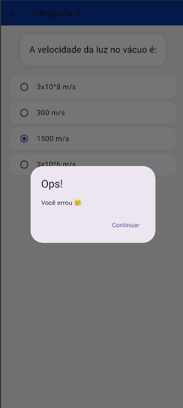

# Quiz em Flutter

Aplicação desenvolvida em Flutter de um Quiz de Física apresentado ao Professor Ederson

## Tecnologias

Flutter

Dart

JSON (assets locais)

## Passo a passo para testar este código

1. Clone este repositório
2. Abra no VS Code
3. Instale as dependências:
"flutter pub get"

4. Execute o projeto:
"flutter run"

## Pictures

Home

Tela de Perguntas

Card de Acerto

Card de Erro

Resultado Final